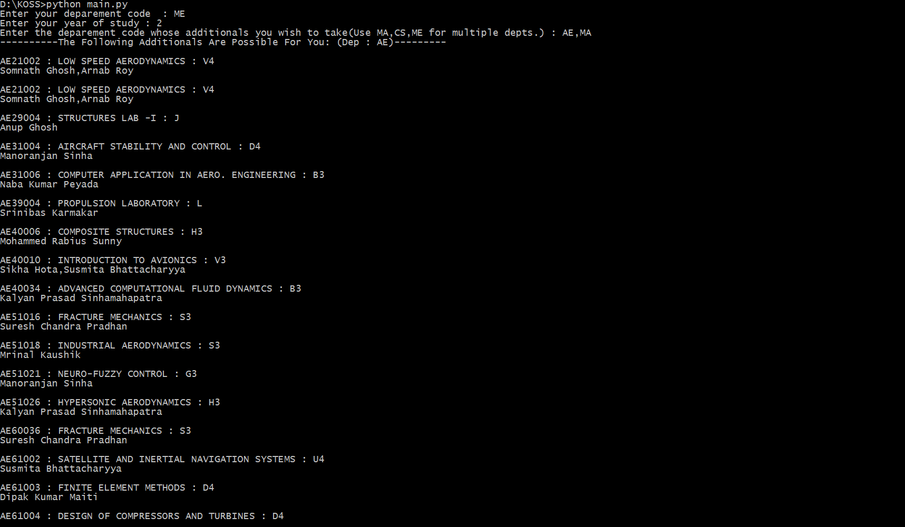
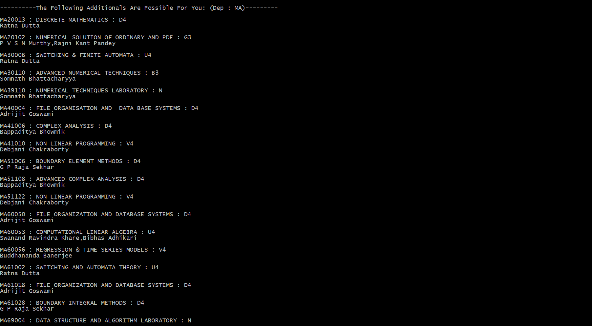

# PASA
Python scripts to suggest list of possible additionals each semester

<h1>Instructions to run : </h1>

```
python main.py
```

Enter the department,year of study and the target department(s).




To generate data by scraping : 
Get the scraped <b>HTML</b> pages off ERP : 
```
python subjects2html.py
```
```
python timetable2html.py
```

To convert HTML to json format : 
```
python subjects_html2json.py (OR) python timetable2json.py
```

<h1>Contribution : </h1>
Read the wiki for the description of the code.
